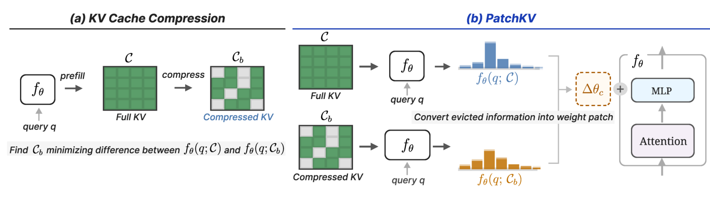

# PatchKV: Weight-Space Compensation of KV Cache

Official implementation of [PatchKV: Weight-Space Compensation of KV Cache](https://arxiv.org/abs/2609.39329)(**NeurIPS 2026**).



**PatchKV** compensates KV cache compression with a context-specific weight patch
computed by closed-form ridge regression. 

## Abstract
Long-context inference with Large Language Models (LLMs) is bottlenecked by the linearly growing memory of the key-value (KV) cache. Existing compression methods reduce the cache through token eviction or approximation, but degrade sharply at aggressive compression budgets. We propose **PatchKV**, a training-free framework that compensates KV cache compression methods by carrying part of the context in the model's weights. **PatchKV** pairs an off-the-shelf compressed KV cache with a context-specific weight patch, which is computed once at context-loading time and served for downstream queries for the context.  The weight patch is derived in closed form via ridge regression, by aligning the block-wise activations of context-derived reference query tokens under the full cache and the compressed cache. Once merged into the model, the patch leaves the forward graph and per-query inference cost unchanged in the single-context, multi-query setting. Across long-context QA (SCBench with up to 170k tokens, SQuAD, NIAH) and math (GSM8K) benchmarks on three model architectures, **PatchKV** consistently improves cache compression methods, suggesting an alternative direction to compensate them at aggressive budgets. 


## Structure

```text
.
├── eval.py                     # Compression → patching → evaluation
├── args.py                     # CLI options and defaults
├── model/                      # Shared model loading, prompts, and generation
├── attention/                  # KVzip and AM backends
│   ├── kvcache.py              # Cache storage and eviction
│   ├── score.py                # KVzip importance scoring
│   └── am.py                   # AM reference queries and compression
├── patching/                   # PatchKV, shared by both backends
│   ├── patch.py                # Sequential ridge fitting and weight restoration
│   └── references.py           # Repeat-context, self-study, and joint references
├── data/
│   ├── load.py                 # Dataset loaders
│   └── needle/                 # NIAH generator and bundled source essays
├── results/
│   ├── metric.py               # Dataset-specific scoring
│   └── parse.py                # Aggregate saved predictions
├── scripts/
│   ├── kvzip_patch.sh          # KVzip baseline + three patch variants
│   └── am_patch.sh             # AM baseline + three patch variants
├── configs/                    # Precomputed AM head budget
├── figures/                    # README figure
└── requirements.txt            # Python dependencies
```

## Installation

We use Pytorch 2.6.0, CUDA 12.4, Python 3.11:

```bash
pip install -r requirements.txt
# Only if FlashAttention 2 is not already installed:
pip install flash-attn==2.7.4.post1 --no-build-isolation
```

## Usage
Evaluate KVzip + PatchKV on one SQuAD context at 10% retention:

```bash
CUDA_VISIBLE_DEVICES=0 python eval.py \
  -m qwen3-4b -d squad --baseline kvzip \
  --patch --patch_data repeat-context --num 1 --ratios 0.1
```

All questions in the context are evaluated independently, alongside a full-cache
control at retention `1.0`. Use `--baseline am` for AM, omit `--patch` for a
baseline-only run, or select `--patch_data self_study` / `joint`.

The example scripts each run baseline, `repeat-context`, `self-study`, and `joint`.
Set `MODEL` and `DATA`:

```bash
CUDA_VISIBLE_DEVICES=0 MODEL=[model name] DATA=[dataset name] \
  bash scripts/kvzip_patch.sh
CUDA_VISIBLE_DEVICES=0 MODEL=[model name] DATA=[dataset name] \
  bash scripts/am_patch.sh
```


## Evaluation
Each context produces a QA-only JSON under the result path:
`results/<checkpoint>/<dataset>_<baseline>_<reference>_<UTC timestamp>/`.

Aggregate all runs or one model without using a GPU:

```bash
python -m results.parse  [result-directory]
```

We can resume the run with `--resume <existing-run-directory>` and the original evaluation
options; completed contexts are skipped.

## Options

| Option | Default | Description |
|---|---|---|
| `-m`, `--model` | `qwen2.5-7b` | Also `qwen3-4b`, `llama3.1-8b`, or their full Hugging Face IDs |
| `-d`, `--data` | `squad` | Dataset name from the [table above](#datasets) |
| `--baseline` | `kvzip` | `kvzip` or `am` |
| `--patch` | Off | Enable PatchKV |
| `--patch_data` | `repeat-context` | `repeat-context`, `self_study`, or `joint` |
| `--chunk_length` | `5000` | Tokens per repeat-context patch chunk |
| `--lam` | `0.001` | Base ridge coefficient with weighted scaling |
| `--ratios` | `0.2,0.1,0.05,0.02,0.01,0` | Retained context KV fractions; `1.0` is always included |
| `--idx`, `--num` | `0`, `100` | First context index and number of contexts; all questions are used |
| `--max_new_tokens` | Dataset-specific | Override the evaluation generation cap |
| `--am_head_budget` | None | Optional [AM head budget](configs/README.md); otherwise uniform |
| `--result_root` | `results` | Output root |
| `--resume` | None | Existing run directory to resume with the same options |

See `python eval.py --help` for all options.


## Acknowledgments

This code builds on [KVzip](https://github.com/snu-mllab/KVzip), with Attention
Matching adapted from [compaction](https://github.com/adamzweiger/compaction).
We thank the authors for sharing their work. Their license
notices are retained in [licenses/KVzip-LICENSE](licenses/KVzip-LICENSE) and
[licenses/AM-LICENSE.txt](licenses/AM-LICENSE.txt).
